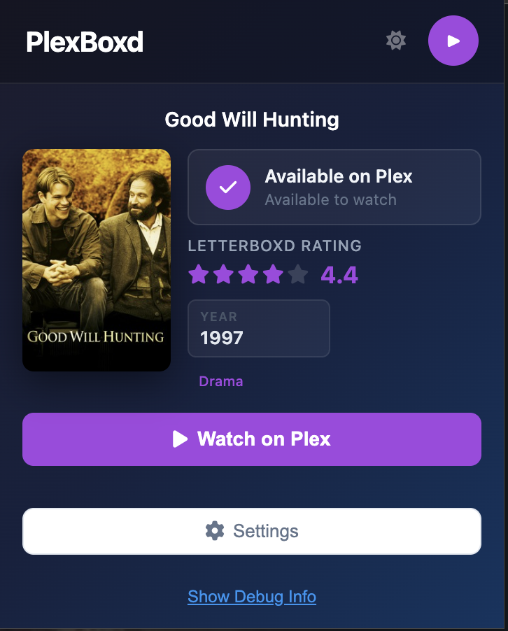
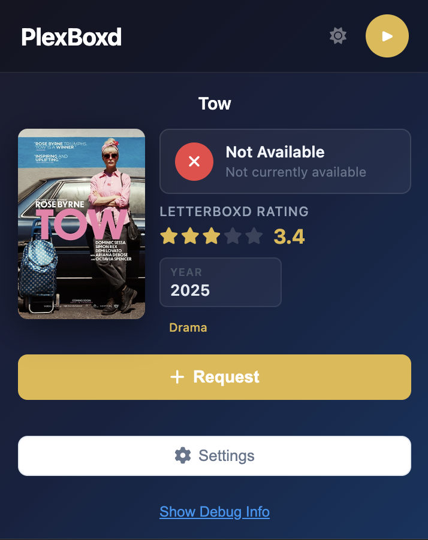
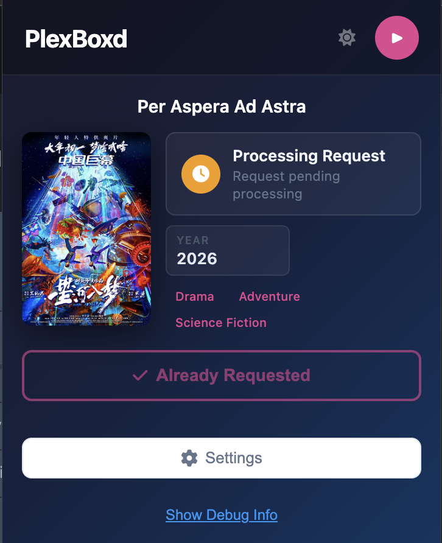

# PlexBoxd

**PlexBoxd** is a Chrome extension that makes it effortless to check if a movie you're browsing on [Letterboxd](https://letterboxd.com) is available via your Plex server (through Overseerr or Ombi) — and lets you request it with a single click if it's not.

## 🚀 Features

- 🔍 Detects when you're viewing a film on Letterboxd
- ⚡ Instantly checks availability via Overseerr or Ombi
- 🎬 One-click movie requests when content isn't available
- 🔐 Plex account authentication with 30-day session persistence
- ⭐ Letterboxd community rating and your personal rating (stars + score)
- 🎨 Dynamic accent color per film, with light/dark theme toggle
- 🖥️ Requests route through your configured Overseerr or Ombi instance, which manages your Plex library

## 🛠 Setup

1. Clone or download this repository.
2. Open Chrome and go to `chrome://extensions/`
3. Enable **Developer Mode** (top right).
4. Click **Load unpacked** and select the project folder.
5. Click the extension icon, then **Settings** to configure your server.

### 🧩 Server Requirements

Choose either **Overseerr** or **Ombi** in settings.

**Overseerr (recommended):** Supports two auth methods:
- **Plex login** — click *Sign in with Plex* in settings. Requests are attributed to your user account in Overseerr.
- **API Key** — found in your Overseerr instance under **Settings** → **General** → **API Key**.

**Ombi:** Supports the same two auth methods as Overseerr:
- **Plex login** — automatically uses your connected Plex account (no extra setup needed once Plex is connected).
- **API Key** — found in Ombi under **Settings** → **Configuration** → **API Key**.

## 📁 Project Structure

```
├── manifest.json            # MV3 extension config
├── background.js            # Service worker: Plex PIN OAuth polling
├── content-script.js        # Extracts movie info from Letterboxd film pages
├── popup.html / popup.js    # Main popup UI and availability logic
├── settings.html / settings.js  # Server config, Plex auth UI
├── plex-auth.js             # Plex PIN-based OAuth flow
├── overseerr-integration.js # Overseerr API: search, availability, requests
├── ombi-integration.js      # Ombi API: search, availability, requests
├── style.css                # Shared styles (popup + settings)
```

## 📸 Screenshots

| Available on Plex | Not Available | Already Requested |
|:-:|:-:|:-:|
|  |  |  |
| Movie is in the Plex library — **Watch on Plex** button links directly to the movie page. | Movie isn't available — **Request** button sends it to Overseerr with one click. | Request is already queued or processing in Overseerr. |

The popup shows the Letterboxd community rating (stars + score), movie poster, release year, and genre tags. The accent color adapts dynamically to each film's title. A light/dark theme toggle is available in the top-right corner.

## 🗺️ Planned Features

- 🖥️ Multiple server profiles — connect several Plex libraries, each with its own Overseerr or Ombi instance
- 🌐 Support for more movie sites (beyond Letterboxd)
- 🦊 Firefox version *(in progress)*

## 📦 Releases

A pre-packaged version of the extension will be available soon under the **Releases** section for easy installation.

## 🤝 Contributing

Got feedback, ideas, or bug reports? Open an issue or submit a pull request.
